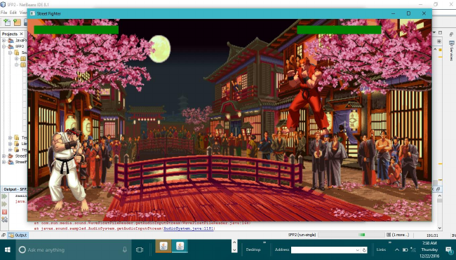
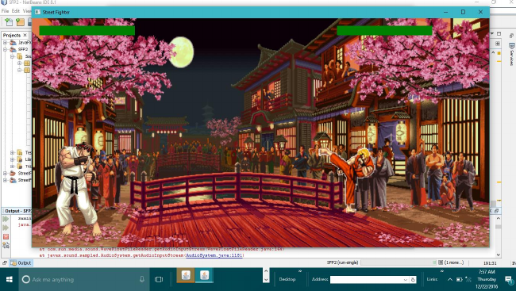

# JavaFX-Street-Fighter-Game
## Introduction
This is a JavaFX implementation of the popular game 'Street Fighter' for our Object Oriented Programming sessional course project. 
We used UDP protocol to implement the networking part. 

## How to run it
Two players will install the game from two computers and they will connect to the same LAN. One of those PCs will run the server and they will have to enter the same port number in the client part's prompted screen where they want to connect. Then they will reach to the game screen and they can start playing. 

## Screenshots
### Background

### Gameplay

